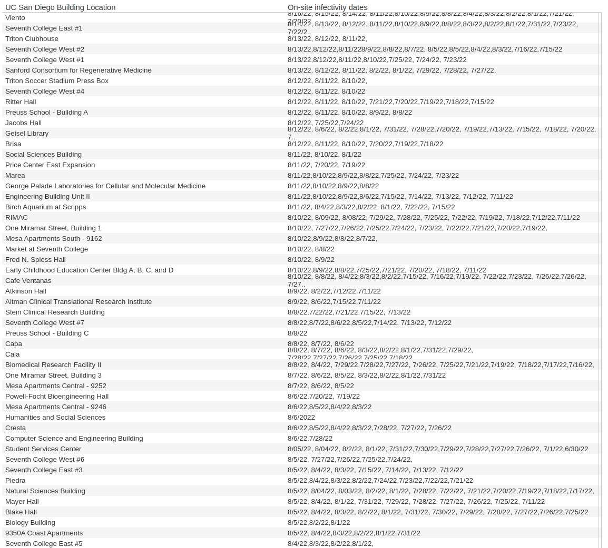
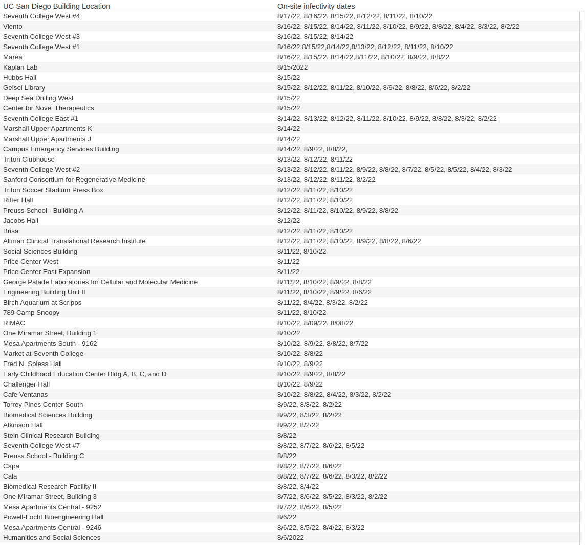

# Potential Exposure Locations Date Updater <!-- omit from toc -->

This is a Python project that automates maintenance of UCSD's Potential Exposure
Locations table.

## Contents <!-- omit from toc -->

- [Description](#description)
- [Objective](#objective)
- [Motivation](#motivation)
- [Learning and Practical Focuses](#learning-and-practical-focuses)
- [Implementation](#implementation)
- [Instructions](#instructions)
- [Notes to User](#notes-to-user)
- [Before](#before)
- [After](#after)

## Description

The [UC San Diego COVID-19 Daily
Dashboard](https://returntolearn.ucsd.edu/dashboard/index.html) provides
various campus related COVID-19 data. The website pulls data from the Potential
Exposure Locations table which gets updated by many different teams around
campus. The table lists the locations and dates that COVID-19 positive
individuals were present at within the last 14 days. After 14 days, the dates
are moved to an archived column that doesn't show on the website. Prior to this
project, maintaining the table involved manually cleaning up the spreadsheet
and archiving old dates. Now maintenance can be done automatically.

## Objective

Automate manually cleaning up the spreadsheet and archiving old dates correctly.

## Motivation

With nearly 500 locations in the data table, it takes a significant amount of
time to do this simple maintenance. As a result, it is done infrequently and
the table is inconsistent and full of old dates.

## Learning and Practical Focuses

- Python unittest
- Modular Programming
- Self documenting code
- Simple logging and nested exceptions
- Creating Python executables
- Python function annotations

## Implementation

All of the data is stored in a Google Sheet, so I needed to get the data
locally to work with. Copying a column converts it into a CSV and this is how I
was able to work with the data in Python.

Since each CSV is text, each date has to be parsed, processed and then returned
to a CSV. To process dates, they need to be compared to determine which comes
first, and if they are too old. To do this comparison, I made a [Date](date.py)
class so that each date in the CSV could be turned into an object, processed
and then output as text once done.

I also had to account for incorrect or inconsistent data. This includes typos,
ranges of dates, and dates out of chronological order. This is why I decided to
use exceptions that create a [log](./log.txt) file that documents what errors
need to be fixed. Once the log file indicates that there are no errors, the
output files are correct.

Making sure that these files were indeed correct was very important to me since
many people referenced this table and fixing the errors after the fact would be
very arduous. Creating [unittests](./test_dates.py) helped streamline testing
as I went and gave me peace of mind that things were working correctly. There
were a few bugs that made it out, but there were caught and fixed quickly.

Here is an example of some errors in the log file:

```txt
Today: 8/9/24
14 days ago: 7/26/24
-------------------------------------------------------
Error on line 9 in cur_dates.txt. 7/27/2022 is an invalid Date.
Error on line 10 in arc_dates.txt. Date formatted incorrectly
Error on line 40 in cur_dates.txt. Dates are not in order from newest to oldest.
-------------------------------------------------------
Done
```

## Instructions

1. Download the dist folder.
1. Paste the "On-site infectivity dates" column into current_date.txt.
1. Paste the "Older Dates" column into archived_dates.txt.
1. Run date_updater.
1. Check log.txt to see all the errors that need to be fixed.
1. Fix errors.
1. Repeat running date_updater and fixing errors until there are none.
1. Paste content of current_dates_updated.txt into the "On-site infectivity
   dates" column.
1. Paste content of archived_dates_updated.txt into the "Older Dates" column.

## Notes to User

- The dist folder contains the executable file.
- User must have personal access to RTL table to get data.
- Dates must be in mm/dd/yy format.
- Dates are to be separated by commas.
- Date ranges (1/2/3 - 1/20/3) are not valid.
- Folder and file names cannot be changed.
- No need to manually add dates to the Older Dates column, this will do it for
  you.

## Before



## After

